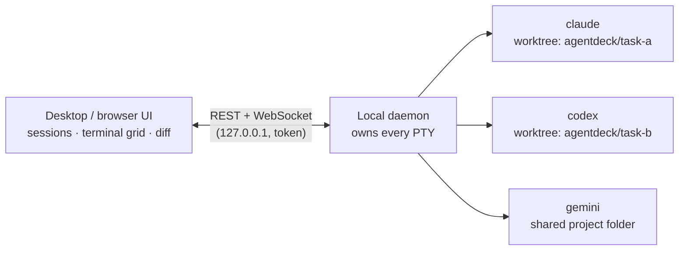

# agentdeck

A local workbench for running AI coding agents in parallel. Run Claude Code, Codex, Gemini CLI and other agents side by side, across projects, without them stepping on each other's working copy.



## What it does

- **Isolated sessions** – each task can run in its own `git worktree` and branch, or directly in the project folder.
- **Works** – group the terminals you open for one goal (e.g. "i18n support") under a named work. New terminals open in the work you are looking at, so side tasks don't land in the wrong place.
- **Claude conversation history per work** – every Claude conversation started in a work, including the new one after `/clear` or `/resume`, is listed with its first and last prompt and can be resumed with one click. This adds a `SessionStart` hook to your Claude `settings.json`; it does nothing outside agentdeck terminals.
- **Sessions outlive the window** – agents run in a background daemon; close the app and they keep working.
- **Terminal grid** – watch and drive several agents at once; split, resize and maximize panels.
- **Know when an agent needs you** – sessions waiting for approval or input are flagged, with desktop notifications.
- **Review the work, send fixes back** – a file tree, sticky file headers, unified or side-by-side diff with word-level highlights. Comment on a line or a range; the notes go to that session's agent as one numbered message, or one by one as you write them.
- **Pull requests** – open a PR from a session's branch, review any open PR, and forward reviewers' comments to the agent. Uses your GitHub CLI login (`gh auth login`); agentdeck stores no token.
- **Claude account switching** – sign in to several Claude accounts once, switch with one click from the sidebar.
- **Keyboard first** – command palette (`Ctrl+K`), `Alt+1…9` to jump between sessions, themes in settings.

## Install

Requirements: Linux, Node 22+, Git, and the agent CLIs you want to use on your `PATH`. For pull requests, the [GitHub CLI](https://cli.github.com) signed in with `gh auth login`.

**One command:**

```bash
git clone https://github.com/osmntahir/agentdeck.git && cd agentdeck && npm install && npm run build && npm run install-desktop -- --desktop && npm run app
```

This also puts an **agentdeck** icon in your app menu and on your desktop; after that, open it like any other desktop app.

**Step by step:**

```bash
git clone https://github.com/osmntahir/agentdeck.git
cd agentdeck
npm install
npm run build
npm run install-desktop -- --desktop   # optional: app menu + desktop icon
npm run app                            # opens the window
```

Leave out `-- --desktop` to add it to the app menu only. If your desktop still asks before opening the icon, right-click it and choose **Allow Launching**.

Prefer the browser? Run `npm run build && npm start` and open the `http://127.0.0.1:4711/?token=…` URL it prints.

If `npm install` fails while building `node-pty`, install build tools: `sudo apt install build-essential python3`.

## Update

```bash
git pull && npm install && npm run build
```

Reload the window with `Ctrl+Shift+R`. If the server code changed, restart the daemon as well (this stops running sessions):

```bash
pkill -f dist/server/index.js; npm run app
```

## Development

```bash
npm run dev         # daemon on :4711 + Vite on :4710
npm test
npm run typecheck
```

Design decisions live in [`docs/adr`](docs/adr) and the domain vocabulary in [`CONTEXT.md`](CONTEXT.md).
